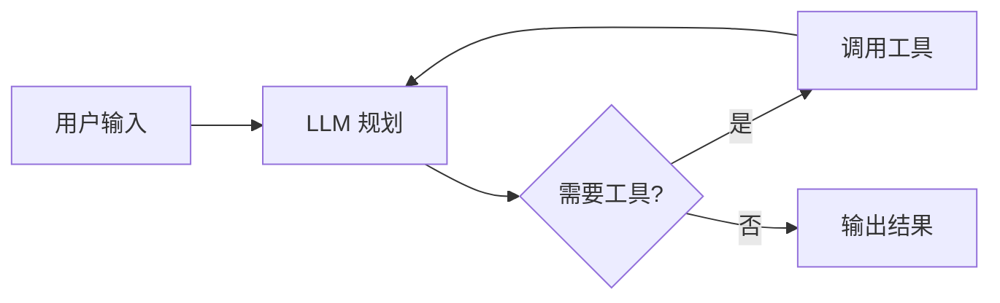
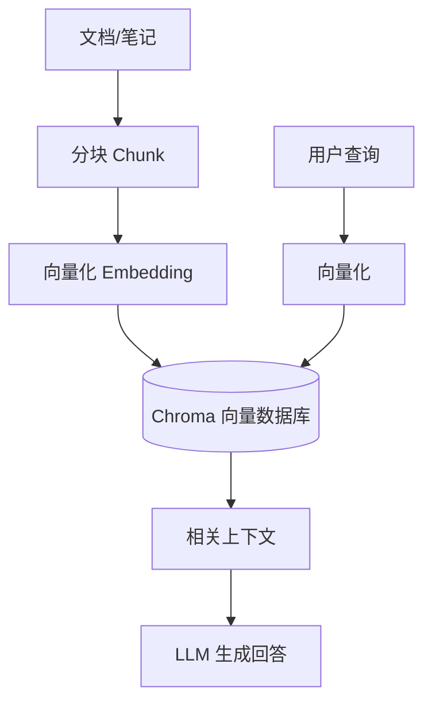

# Agent 开发入门

> 🚧 本笔记持续更新中
> 来源：[Agent 开发入门](https://www.notion.so/Agent-9b1c8e5a0c7b4e5f9d2a1e8c3f6a7b)（Notion）

## 什么是 AI Agent？

AI Agent 是能够**感知环境、规划目标、调用工具并执行动作**的 LLM 应用。

## 核心组件

- **LLM** — 大脑（GPT-4o / Claude / Llama3）
- **Memory** — 短期（上下文）+ 长期（向量数据库）
- **Tools** — 搜索、代码执行、API 调用
- **Planning** — ReAct / CoT / Tree-of-Thought

## RAG 架构

## 技术栈选择

| 组件 | 选型 |
|------|------|
| 向量数据库 | **Chroma** |
| Embedding | sentence-transformers |
| LLM 框架 | LangChain / LlamaIndex |
| 本地推理 | llama.cpp / Ollama |

!!! warning "注意"
    向量数据库选型请根据数据量决定，小项目首选 **Chroma**，生产环境可考虑 Weaviate / Qdrant。
