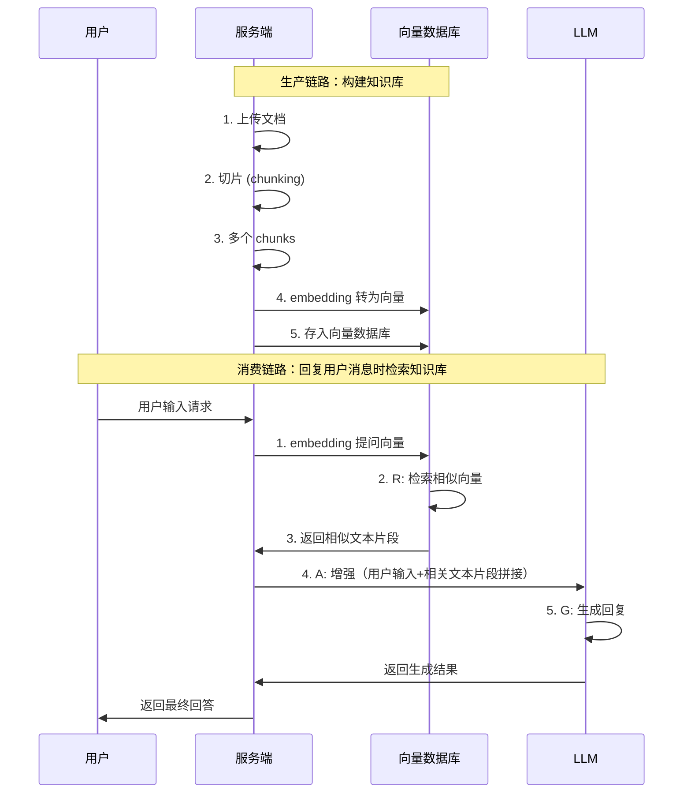

# RAG 技术

## 什么是RAG？
RAG（Retrieval-Augmented Generation）是一种结合了检索和生成的技术

## 解决的问题
- **知识过时**：LLM 训练数据截止，无法回答最新信息
- **幻觉问题**：LLM 可能生成看似合理但实际错误的内容
- **长文本处理**：LLM 上下文窗口有限，无法处理过

## RAG核心思路
1. **检索阶段**：根据用户输入，从外部知识库（文档、数据库、API）检索相关信息
2. **生成阶段**：将检索到的信息与用户输入一起作为提示，生成最终回答

## 实现方式
- **基于向量数据库**：如 Chroma，使用文本嵌入进行语义检索
- **基于关键词匹配**：简单但效率较低，适合小规模
- **基于混合检索**：结合关键词和向量检索，提升准确率

## 应用场景
- **问答系统**：提供最新信息的回答
- **文档摘要**：结合文档内容生成摘要
- **代码生成**：结合 API 文档生成代码

## 动手实现

> 1. 准备知识库：收集相关文档，构建向量数据库
> 2. 实现检索模块：根据用户输入检索相关文档
> 3. 实现生成模块：将检索结果与用户输入一起作为提示，调用 LLM 生成回答
> 4. 优化提示设计：确保生成结果准确且相关

> 参考项目：https://github.com/datawhalechina/all-in-rag

## 提高RAG效果的技巧
上述描述的是简单的分快法，即使用固定的长度切片（chunking）方法将文档切分成多个片段（chunks），每个片段独立存储在向量数据库中。这种方法虽然简单，但可能会导致信息碎片化，影响检索效果。有以下几种改进方法：

### 不同切分方法对比

> 后续补充更多切分方法，如语义切分、Small-to-Big Retrieval、Context Enriched Retrieval、递归切分、滑动窗口切分等，并对比它们的优缺点和适用场景。

| 切分方法 | 实现逻辑 | 优点 | 缺点 | 适用场景 |
|---------|------|------|------|---------|
| **固定长度切片** (Fixed-size Chunking) | • 将文档按固定长度切分为多个片段 | • 实现简单，计算效率高 • 处理速度快 • 资源消耗少 | • 可能破坏语义完整性 • 容易断章取义 • 信息碎片化严重 | 对语义要求不高的场景，如日志分析 |
| **语义切分** (Semantic Chunking) | • 根据句子语义相似度进行切分，保持信息完整性 | • 保证语义连贯性 • 减少断章取义 • 提高检索准确度 | • 计算成本较高（需要计算相似度） • 实现复杂度高 • 分块大小不均匀 | 问答系统、知识库检索等需要精确语义的场景 |
| **Small-to-Big Retrieval** (Small-to-Big Retrieval) | • 先检索小块，再根据需要扩展到大块，要构建块的父子关系 | • 保持语义完整性 • 提高召回率 | • 实现复杂 • 可能增加检索时间 • 需要设计合理的扩展策略 | 需要兼顾精确和全面的场景，如法律文档分析 |
| **Context Enriched Retrieval** (Context Enriched Retrieval) | • 在检索时考虑上下文信息 | • 提高相关性 • 减少信息丢失 | • 实现复杂 • 需要设计合理的上下文策略 • 可能增加计算成本 | 需要完整上下文的场景，如医疗记录分析 |
| **递归切分** (Recursive Chunking) | • 保留文档层次结构，适应不同粒度需求 | • 灵活性高 | • 实现复杂 • 可能产生过多小块 • 需要精心设计递归策略 | 结构化文档（如代码、技术文档） |
| **滑动窗口切分** (Sliding Window) | • 保证上下文重叠，减少边界信息丢失 | • 提高召回率 | • 存储空间需求大 • 可能产生冗余信息 • 检索时间增加 | 需要完整上下文的场景，如法律文档分析 |

> 后续补充 RAG 相关内容，包含原理、实现细节、应用场景等。