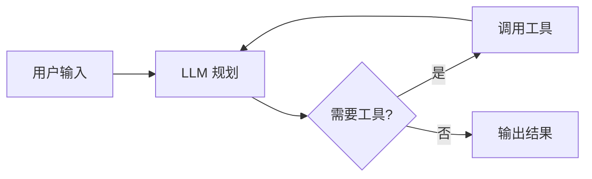
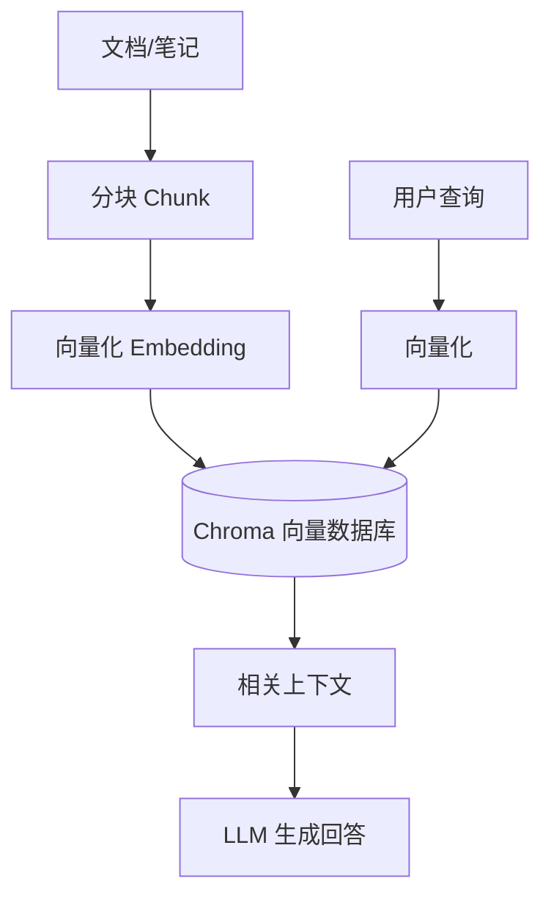

# 计算机基础

> 🚧 本笔记持续更新中

## 操作系统类

- 为什么要学习操作系统？我认为学习操作系统不仅能够帮助我们理解计算机系统的底层原理，还能提升我们分析和解决问题的能力。操作系统中蕴含的诸多思想和经典算法，在日常开发中随处可见，比如缓存机制、调度算法等。通过掌握这些知识，我们可以更好地理解和优化应用程序的性能设计，例如缓存的命中率、淘汰策略等都与操作系统密切相关。此外，操作系统知识是技术面试中的高频考点，对于打好计算机基础、提升技术深度和广度都至关重要
- 推荐的书籍
    - 《操作系统导论》-- 经典教材，适合初学者，内容全面，讲解清晰。
    - 《深入理解计算机系统》-- 系统性强，适合有一定基础的读者，深入讲解计算机系统的各个方面。

## 计算机网络类

## 算法类

## 数据结构

## 计算机专业基础课

### 数学
1. 微积分
2. 线性代数
3. 概率论
4. 离散数学
### 英语
1. 熟练使用英文界面的软件、系统等
2. 对于外网的一些博客、bug 解决方案等，阅读无压力
3. 熟练阅读英文文献
4. 具备一定的英文论文的撰写能力

### 编译原理

## 核心组件

- **LLM** — 大脑（GPT-4o / Claude / Llama3）
- **Memory** — 短期（上下文）+ 长期（向量数据库）
- **Tools** — 搜索、代码执行、API 调用
- **Planning** — ReAct / CoT / Tree-of-Thought

## RAG 架构

## 技术栈选择

| 组件 | 选型 |
|------|------|
| 向量数据库 | **Chroma** |
| Embedding | sentence-transformers |
| LLM 框架 | LangChain / LlamaIndex |
| 本地推理 | llama.cpp / Ollama |

!!! warning "注意"
    向量数据库选型请根据数据量决定，小项目首选 **Chroma**，生产环境可考虑 Weaviate / Qdrant。
